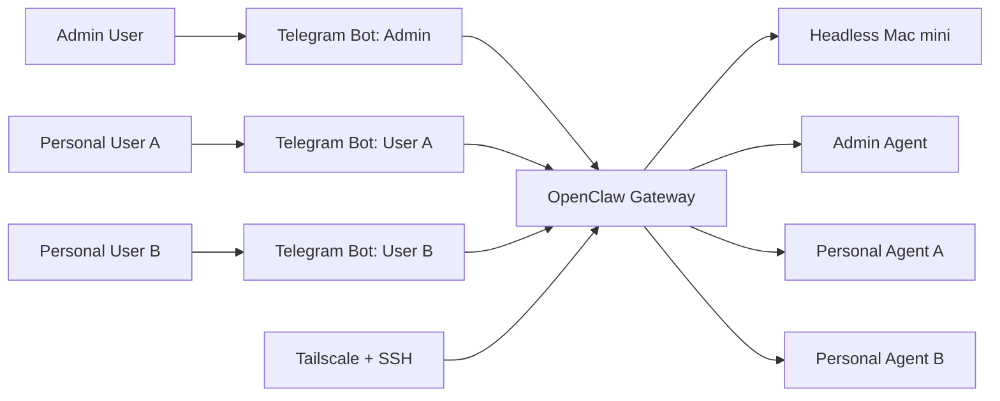
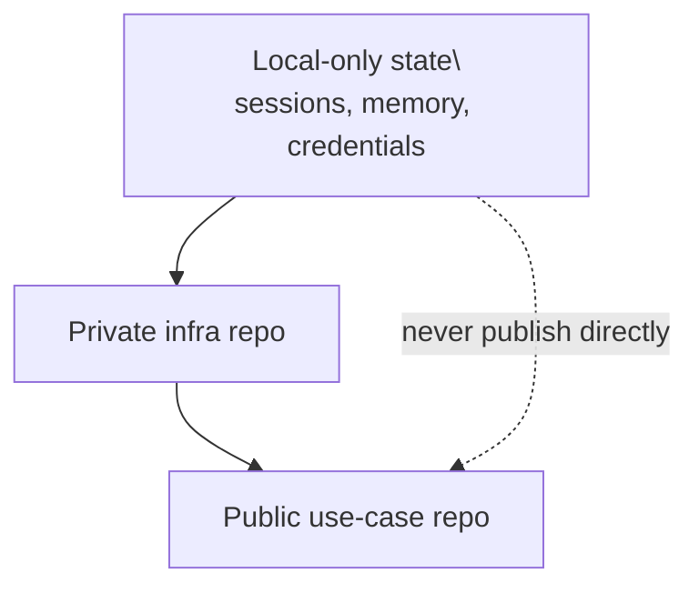

# OpenClaw Headless Mac Mini Use Case

Public-safe reference repository for an always-on OpenClaw deployment on a headless macOS machine.

This repository is intentionally sanitized. It is meant to show the design, not to mirror live operational state.

## What This Covers

- headless Mac mini deployment
- loopback-only OpenClaw gateway
- Tailscale + SSH remote administration
- Telegram as the first user-facing channel
- one Telegram bot per personal agent
- local voice transcription with Whisper
- local + remote model split
- Google Workspace integration via `gws`
- Gemini image-model wiring for image generation/edit flows
- watcher and automation patterns
- versioning boundaries between infra and private state

## What This Does Not Contain

- live secrets
- real hostnames, IPs, or user identifiers
- transcripts
- private agent memory
- operational credentials
- real user workspaces

## Quick View

### System Shape

### Versioning Boundary

## Reading Order

1. [Architecture](docs/architecture.md)
2. [Replication Guide](docs/replication.md)
3. [Lessons Learned](docs/lessons-learned.md)
4. [Versioning Boundaries](docs/versioning-boundaries.md)
5. [Diagrams](docs/diagrams.md)

## Repository Structure

- `docs/architecture.md`: deployment design and trust boundaries
- `docs/replication.md`: step-by-step sanitized setup guide
- `docs/lessons-learned.md`: practical pitfalls and tradeoffs
- `docs/versioning-boundaries.md`: what belongs in Git vs local-only state
- `templates/config/openclaw.template.json`: placeholder config template
- `templates/workspaces/AGENT-GUARDRAILS.md`: baseline guardrails for personal agents

## Intended Audience

People who want to replicate a similar OpenClaw setup without copying live operational state.

## Publication Rule

Keep this repository as documentation and templates only.
Do not turn it into a mirror of live `~/.openclaw` state.
