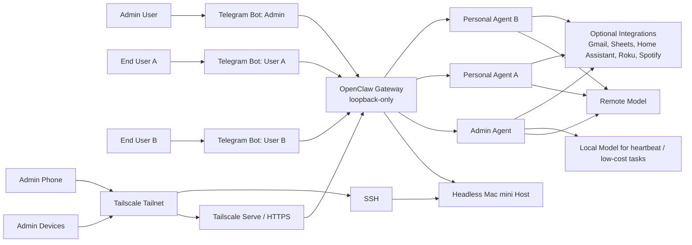
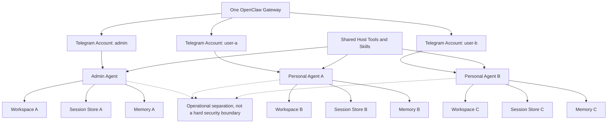

# Architecture

## Goal

Run OpenClaw on a dedicated headless Mac mini with:

- local gateway
- Telegram as the first user-facing channel
- Tailscale and SSH for remote administration
- Screen Sharing / VNC as GUI fallback
- browser UI exposed only over the tailnet
- light automation and durable memory
- separate personal agents for different end users

## Core Layout

- one macOS machine
- one OpenClaw gateway
- one admin/operator agent
- one dedicated Telegram bot per personal agent
- local-only gateway bind
- tailnet-only browser access

## System Diagram

## Why This Shape

### 1. Loopback-only gateway

The gateway stays bound to `127.0.0.1`.
Remote access is layered on top with Tailscale and SSH.
When shell-only access is insufficient, Screen Sharing / VNC can be used as a GUI fallback.

This keeps the control surface off the public internet.

### 2. Multi-bot Telegram instead of same-bot peer routing

A reliable pattern for per-agent Telegram isolation is:

- one bot for the admin agent
- one bot for each personal agent

This avoids depending on same-bot per-user DM routing behavior.

### 3. Shared machine, separate agent identities

Each personal agent gets:

- its own workspace
- its own session store
- its own memory files
- its own future watcher state

This is operational separation, not a hard security boundary.

## Agent Isolation Diagram

### 4. Headless appliance model

The machine is treated like an appliance:

- automatic login
- no system sleep
- restart after power loss
- persistent tailnet access
- OpenClaw auto-recovers on reboot

## Trust Boundaries

### Shared

- host OS
- OpenClaw gateway
- installed tools and skills
- Tailscale / SSH admin plane

### Per-agent

- workspace files
- sessions
- memory
- chat bot/account entrypoint

### Not shared publicly

- credentials
- session transcripts
- private reminders
- user-specific notes

## Practical Limits

- macOS GUI automation is harder than shell control
- stable GUI permissioning prefers a signed app identity over a raw `node` runtime
- personal agents should not be treated as strongly isolated tenants on the same host
