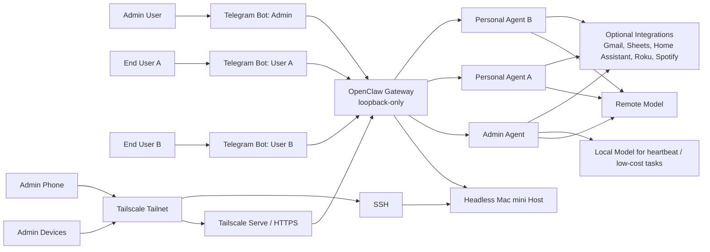
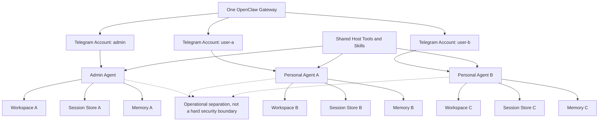
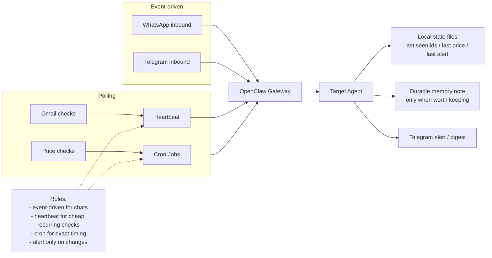
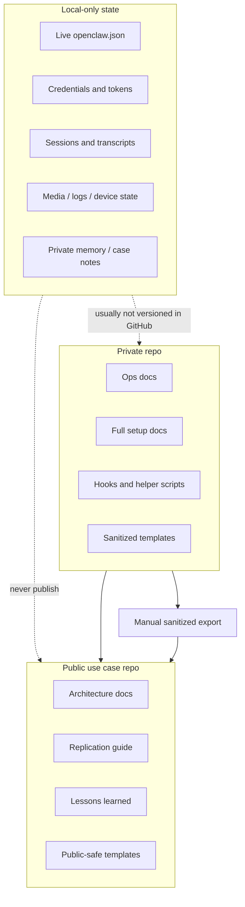

# Diagrams

These diagrams are intentionally generic and public-safe.
They describe the system shape without exposing live host details, user identifiers, or secrets.

## 1. System Architecture

## 2. Agent Isolation Model

## 3. Watchers and Automation Flow

## 4. Versioning Boundaries

