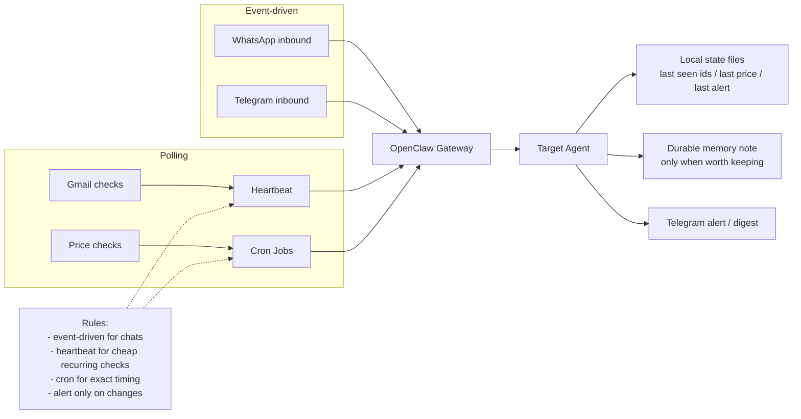

# Replication Guide

This is the shortest practical path to reproduce the same overall architecture safely.

## 1. Install Base Runtime

```bash
npm install -g openclaw@latest
```

Run onboarding:

```bash
openclaw onboard --install-daemon
```

Recommended onboarding choices:

- local gateway
- loopback bind
- token auth
- Tailscale exposure off during onboarding
- Telegram as the first channel
- skip skills and hooks initially

Why:

- start from the smallest secure baseline
- get chat + remote admin working before adding integrations

## 2. Remote Access

Enable:

- SSH
- Tailscale
- Screen Sharing / VNC fallback when GUI access is needed

Recommended model:

- keep OpenClaw local-only
- use Tailscale Serve for browser UI
- use SSH for admin shell access
- keep Screen Sharing only as a fallback for GUI-required situations

Do not expose the gateway directly to the public internet.

Practical note:

- SSH is the primary admin path
- Screen Sharing / VNC is useful when the operator needs a real desktop session for browser login, macOS prompts, or visual recovery
- on Linux clients, enabling legacy VNC password mode on macOS may be required for reliable access

## 3. Telegram

Start with Telegram because it is operationally simple.

Recommended defaults:

- DM-only
- pairing enabled
- group messages disabled initially
- streaming off

If you need separate personal agents, prefer one Telegram bot per agent.

## 4. Audio

Use local Whisper for Telegram voice notes.

Recommended path:

- `whisper-cli`
- local small model
- wrapper script that converts `.ogg`/Opus to `.wav` before transcription

This avoids API transcription cost and works well for short voice notes.

## 5. Memory and Automation

Recommended early setup:

- durable memory backend enabled
- compaction memory flush enabled
- a small `LEARNINGS.md` file for short operational rules
- one daily brief
- one lightweight heartbeat
- no aggressive autonomous remediation

Keep automation cheap and predictable first. Add stronger autonomy only after the host is stable.

Practical defaults:

- use `QMD` for memory search
- enable `compaction.memoryFlush`
- keep `AGENTS.md` short and put startup rules at the top
- use `cron` for reminders and exact alarms instead of background `sleep` loops

## Automation Flow



## 6. Local Models

Recommended split:

- strong remote model for tool-heavy operator work
- cheap local model for heartbeat and background checks
- separate image model for image generation/editing when needed

On a 16 GB Apple Silicon host, small/modest Ollama models are the pragmatic choice.

Example:

- chat/tool work: strong remote model
- heartbeat/background checks: local `qwen2.5:7b`
- image work: `google/gemini-3.1-flash-image-preview`

## 7. Google Workspace

Prefer `gws` over older Google CLIs for new setup.

Recommended services:

- Gmail
- Sheets
- Drive
- Docs
- Calendar

Why:

- better fit for agent workflows
- broader API surface
- structured JSON output
- better long-term path for watchers and operational automation

## 8. Personal Agents

Recommended pattern:

- admin/operator agent
- one separate personal agent per user
- one dedicated Telegram bot per personal agent

Let each user define:

- agent name
- emoji
- style
- how the agent addresses them

## 9. Local Discovery

Use `goplaces` for real-world place lookup:

- restaurants
- pharmacies
- clinics
- markets
- addresses
- opening hours
- ratings

Why:

- better than generic web search for nearby places and business lookup
- structured results
- works well for Telegram-driven day-to-day requests

Important boundary:

- `goplaces` is for search/details
- it does not write into a user's Google Maps account or saved places
- for navigation, send Maps links instead of trying to mutate Google Maps state

## 10. Smart-home / Daily-use Extensions

Good candidates:

- Home Assistant
- Spotify control
- Roku control
- camera integration
- Gmail / Sheets later

Defer account-heavy integrations until the base system is stable.
