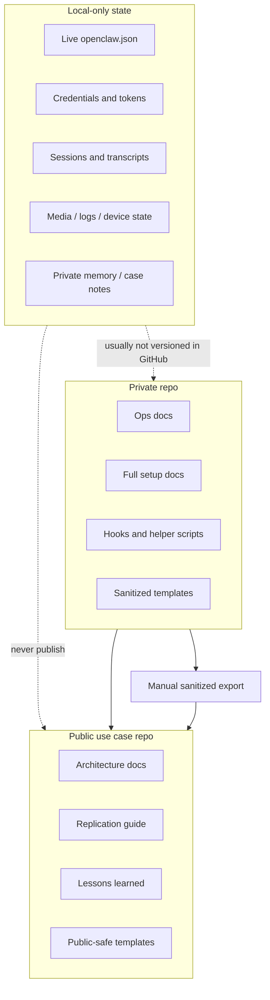

# Versioning Boundaries

## Put In Git

- setup docs
- operations docs
- hooks
- helper scripts
- sanitized templates
- watcher templates
- automation playbooks

## Keep Local Only

- live `openclaw.json`
- credentials
- Telegram state
- devices
- logs
- media
- session transcripts
- durable user memory with private facts
- private legal, personal, or financial notes

## Public Export Rule

A public repo should describe the system, not mirror the live system.

If a file contains any of these, it stays out:

- a secret
- a stable user identifier
- a private transcript
- a host-specific operational detail that is unnecessary for replication
